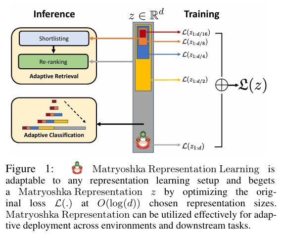
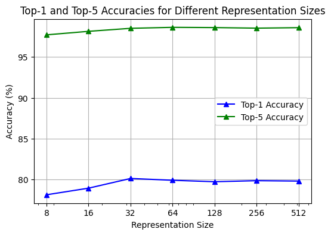

# Matryoshka Representation Learning (MRL) Project

## Overview
This repository contains the implementation and results of the Matryoshka Representation Learning (MRL) project. MRL is a novel approach that encodes information at multiple granularities within a single representation vector, allowing for dynamic adjustment of representation sizes based on task complexity. This project demonstrates the flexibility, efficiency, and performance improvements offered by MRL.

## Table of Contents
- [Introduction](#introduction)
- [Usage](#usage)
- [Results](#results)
- [Conclusion](#conclusion)
- [Contribution](#contribution)

## Introduction
Matryoshka Representation Learning (MRL) is inspired by Matryoshka dolls, where smaller dolls are nested within larger ones. Similarly, MRL encodes hierarchical representations that can be truncated at different levels to balance between computational efficiency and accuracy. This repository contains the code, datasets, and results of our MRL implementation and experiments.

## Usage
### Data Preparation
- Download the CIFAR-10 dataset and place it in the `cifar/` directory.

### Running Experiments
- Open the Jupyter notebooks to run the experiments interactively.
- Alternatively, use the command line to train and evaluate the model.

## Results
The main results of the project are summarized below:

- **Improved Flexibility and Adaptability:**
  - MRL encodes information at multiple granularities within a single representation vector.
  - The model dynamically adjusts representation size based on task complexity.
- **Performance Improvements:**
  - Top-1 Accuracy: Fluctuates between 78.10% and 80.10%, peaking at a size of 32. Remains stable around 79.70% to 80.10% for sizes 32 to 512.
  - Top-5 Accuracy: Consistently high, ranging from 97.72% to 98.64%, indicating robust performance.
- **Efficiency:**
  - MRL achieves comparable or better accuracy with significantly smaller representation sizes.
  - High accuracy with smaller sizes reduces computational costs and inference times.
- **Real-World Impact:**
  - The efficiency and adaptability of MRL make it suitable for environments with limited computational resources.
  - MRL maintains robust performance even with reduced representation sizes, demonstrating practical applicability.

## Conclusion
The implementation of Matryoshka Representation Learning (MRL) in this project has demonstrated significant benefits in terms of flexibility, efficiency, and performance. The results validate the effectiveness of MRL in maintaining accuracy while adapting to different computational constraints.

## Contribution
This project was done as a part of NYU's High Perfromance Machine Learning course (Spring 2024) by Amrutha Patil (ap7982) and Khushi Sharma (ks7406).

Thank you!

